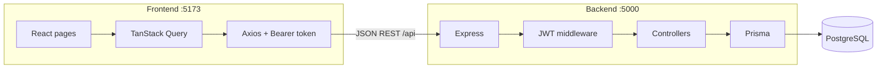
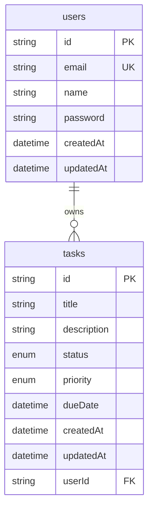
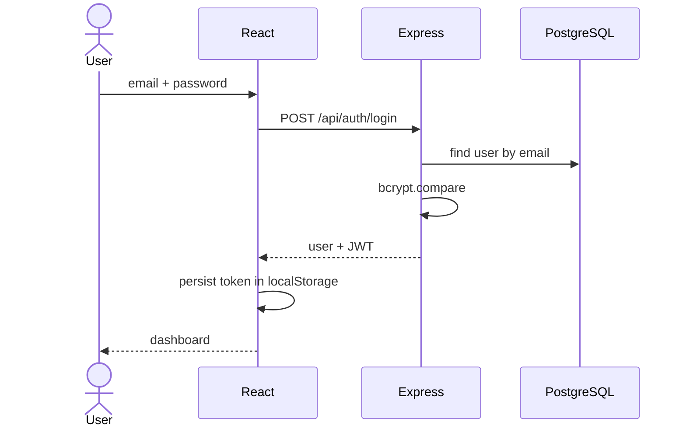
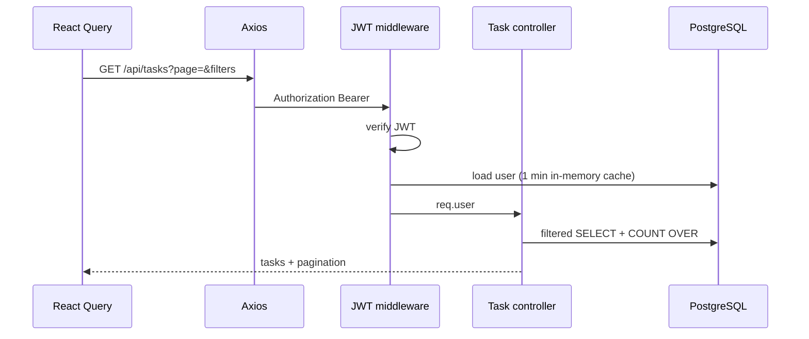
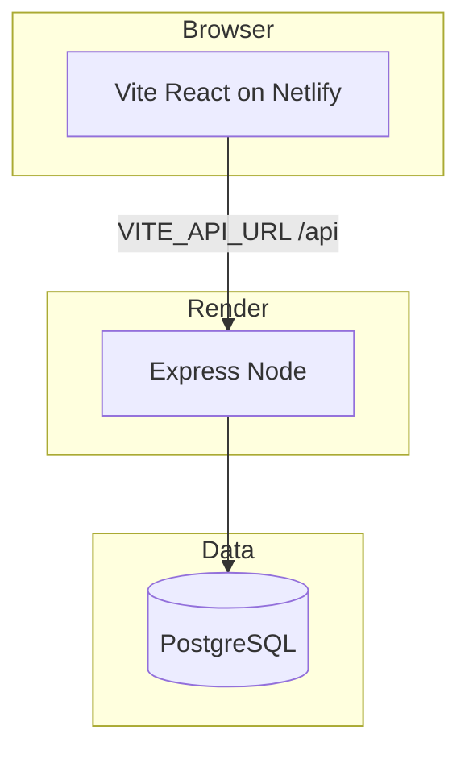

# Task Manager

A full-stack personal task manager: register, log in, and CRUD tasks with status, priority, due dates, search, filters, and stats. Built as a portfolio project to show a typed Express API, Prisma + PostgreSQL, and a React SPA with protected routes.

**Live demo:** [https://fastidious-malasada-4d05ec.netlify.app/](https://fastidious-malasada-4d05ec.netlify.app/) (Netlify) · **API:** [https://task-management-app-1r5j.onrender.com/api](https://task-management-app-1r5j.onrender.com/api) (Render)

```
task-management-app/
├── backend/     # Express, Prisma, PostgreSQL
├── frontend/    # React, Vite, Tailwind, React Query
└── package.json # npm workspaces
```

---

## Problem

Generic to-do apps are either too simple (no auth, no ownership) or too heavy (teams, boards, billing). This project is a **single-user workspace per account**: each person sees only their own tasks, with enough structure to practice real API design (JWT, validation, pagination, scoped queries) without extra product surface.

---

## Features

- Register / login with JWT; session restored from `localStorage`
- Protected dashboard vs public login/register routes
- Create, edit, delete tasks (title, description, status, priority, due date)
- Filter by status / priority, full-text-style search (`ILIKE` on title and description), sort, paginated list
- Stats: counts by status and priority, plus overdue (due date in the past and not `DONE`)
- Light / dark theme
- API health indicator in the UI
- Toasts for success and errors

---

## Tech stack

| Layer | Choices |
| --- | --- |
| Frontend | React 18, TypeScript, Vite, Tailwind CSS, React Router, TanStack Query, Axios, date-fns, Lucide |
| Backend | Node 20+, Express, TypeScript, Prisma, express-validator, jsonwebtoken, bcryptjs, Morgan |
| Database | PostgreSQL (local or hosted, e.g. Supabase). Prisma `DATABASE_URL` + `DIRECT_URL` for migrate |
| Repo | npm workspaces (`backend` + `frontend`), `concurrently` for `npm run dev` |

---

## Architecture

SPA talks to a REST API over HTTP. The API owns auth, validation, and data access. Postgres stores users and tasks. Prisma is the default ORM; a few list/update/stats paths use parameterized `$queryRaw` for filters, `COUNT(*) OVER()`, and partial updates.



**Request path:** React Query hook → Axios (`Authorization: Bearer`) → Express route → `express-validator` (writes) → controller → Prisma / SQL → JSON `{ success, data, message? }`.

---

## Database schema

One `User` has many `Task`s. Deleting a user cascades to their tasks. Indexes on `userId`, `status`, and `priority` support scoped lists and filters.



**Enums**

- `TaskStatus`: `TODO` | `IN_PROGRESS` | `DONE` (default `TODO`)
- `Priority`: `LOW` | `MEDIUM` | `HIGH` (default `MEDIUM`)

Source of truth: [`backend/prisma/schema.prisma`](backend/prisma/schema.prisma).

---

## API documentation

Base URL:

- Local: `http://localhost:5000/api`
- Production ([Render](https://task-management-app-1r5j.onrender.com/api)): `https://task-management-app-1r5j.onrender.com/api`

Envelope: `{ "success": boolean, "message"?: string, "data"?: object }`

### Public

| Method | Path | Auth | Purpose |
| --- | --- | --- | --- |
| `GET` | `/health` | No | Liveness + `environment` |
| `POST` | `/auth/register` | No | Create user, return user + JWT |
| `POST` | `/auth/login` | No | Return user + JWT |

**Register body:** `{ name, email, password }`  
Name 2–50 chars. Email normalized. Password ≥ 8 chars, with upper, lower, and a digit.

**Login body:** `{ email, password }`  
Failed login always `401` with `"Invalid email or password."` (no user enumeration). Duplicate email on register: `409`.

### Authenticated (`Authorization: Bearer <token>`)

| Method | Path | Purpose |
| --- | --- | --- |
| `GET` | `/auth/me` | Current user + task count |
| `GET` | `/tasks` | Paginated, filtered list |
| `GET` | `/tasks/stats` | Aggregates for the current user |
| `GET` | `/tasks/:id` | One task (404 if missing or not owned) |
| `POST` | `/tasks` | Create |
| `PATCH` | `/tasks/:id` | Partial update |
| `DELETE` | `/tasks/:id` | Delete |

**`GET /tasks` query:** `status`, `priority`, `search`, `sortBy` (`createdAt` \| `updatedAt` \| `dueDate` \| `priority` \| `title`), `sortOrder` (`asc` \| `desc`), `page` (default `1`), `limit` (default `10`, max `50`).

**Task body (create / patch):** `title` (required on create, 1–200), `description` (optional, max 2000), `status`, `priority`, `dueDate` (ISO 8601 or `null`).

Every task query includes `userId` from the JWT so one account cannot read or mutate another’s rows.

---

## Sequence diagrams

### Login



### List tasks (authenticated)



---

## Authentication strategy

- **Algorithm:** HS256 JWT (`jsonwebtoken`). Payload: `{ userId, email }`. Expiry from `JWT_EXPIRES_IN` (default `7d`).
- **Password:** `bcryptjs` with cost factor **12**. Password hashes are never returned in JSON (`select` omits `password`).
- **Transport:** `Authorization: Bearer <token>`. Frontend Axios interceptor attaches the token; `401` clears storage and fires `auth:logout`.
- **Storage:** JWT + user JSON in `localStorage` (SPA-friendly; see trade-offs).
- **Route guards:** `ProtectedRoute` / `PublicRoute` in React Router.
- **Identity check:** After verify, middleware loads the user from the DB (or a 60s in-memory cache) so a deleted user cannot keep using an unexpired token.

There is no refresh-token rotation in this version: when the access token expires, the user logs in again.

---

## Security considerations

What is in place:

- CORS origin locked to `FRONTEND_URL` (not `*`)
- Input validation on auth and task writes
- Password hashing; generic login errors
- Task access always scoped by `userId`
- Parameterized Prisma SQL (no string-concatenated user input in queries)
- Sort field allowlist (avoids injecting arbitrary `ORDER BY` identifiers)
- JSON body limit `10mb`

Known gaps (acceptable for a local/portfolio app, not a production checklist):

- JWT in `localStorage` is XSS-sensitive; httpOnly cookies would be stronger with a CSRF story
- No rate limiting, Helmet, or account lockout
- No refresh tokens or token revocation list
- Auth user cache is per-process memory (fine for one Node instance)
- `JWT_SECRET` must be a long random value in any shared environment

---

## Testing strategy

There is **no automated test suite** in this repo yet (no unit, integration, or E2E jobs).

Current verification is manual: health check, register → login → `/auth/me`, then create / filter / paginate / edit / delete tasks and confirm another user’s token cannot see those rows.

A reasonable next layer would be: Prisma/controller tests for ownership and pagination, then Playwright for the register–dashboard loop.

---

## Performance considerations

Designed for a single Node process and modest per-user lists, not measured under load. There are **no benchmark numbers** to publish yet.

| Choice | Why |
| --- | --- |
| Pagination + `limit` cap 50 | Bounds list payload size |
| `COUNT(*) OVER()` | One round trip for rows + total |
| Indexes on `userId`, `status`, `priority` | Typical dashboard filters |
| Auth user cache (60s) | Avoids a DB hit on every authenticated request |
| React Query `staleTime` + `keepPreviousData` | Fewer refetches; pagination does not flash empty |
| Stats as one aggregate query | Dashboard counts without N+1 |

For a hosted Postgres pooler (e.g. Supabase), a **long-running** Express process should use the **session** pooler (see `backend/.env.example`). Transaction mode adds extra round trips and feels slow from a remote region.

---

## Trade-offs

| Decision | Chose | Alternative | Why this project |
| --- | --- | --- | --- |
| Auth token storage | `localStorage` + Bearer | httpOnly cookie | Simpler SPA; no extra CSRF cookie work |
| Access token only | 7-day JWT | Short access + refresh | Less moving parts; logout = drop token |
| Data access | Prisma + selective `$queryRaw` | SQL-only or Prisma-only | ORM for CRUD; raw SQL for window count and dynamic filters |
| Monorepo | npm workspaces | Two repos | One clone, shared `npm run dev` |
| Caching | In-process Map | Redis | Zero extra infra for a portfolio API |
| UI data | React Query | Redux / Zustand | Server state fits Query; no global client store needed |

---

## Scaling strategy

This app is sized for **one API instance + one Postgres**. Vertical scale (bigger DB, indexes already in schema) covers a lot of personal-task traffic.

If it grew:

1. **Read path:** keep pagination; add a composite index `(userId, createdAt)` if the default sort dominates.
2. **Auth cache:** move the user lookup cache to Redis if you run multiple Node processes (in-memory cache would diverge).
3. **Stateless API:** JWT already allows more API replicas behind a load balancer; do not rely on process memory.
4. **Pooler:** serverless or bursty deploy → transaction pooler; always-on Node → session pooler / direct connection.
5. **Stop before:** sharding, CQRS, or a job queue — this domain does not need them.

---

## Deployment architecture

There is no Docker Compose in the repo. Production is a static SPA on Netlify, the Express API on Render, and PostgreSQL:



- **Frontend:** [Netlify](https://fastidious-malasada-4d05ec.netlify.app/) serves the Vite production build (`npm run build -w frontend`). `VITE_API_URL` points at the Render API.
- **Backend:** [Render](https://task-management-app-1r5j.onrender.com/api) runs the compiled Express app (`npm run build -w backend` then `npm start`). Production env: `NODE_ENV=production`, a strong `JWT_SECRET`, `DATABASE_URL` / `DIRECT_URL`, and `FRONTEND_URL=https://fastidious-malasada-4d05ec.netlify.app`.
- **Database:** Postgres (local or hosted); run `npm run db:migrate` against `DIRECT_URL`.

A free Render web service can sleep after idle time; the first request after that may wait on a cold start.

---

## Demo

**Live app:** [https://fastidious-malasada-4d05ec.netlify.app/](https://fastidious-malasada-4d05ec.netlify.app/) — register an account and use the dashboard (create, filter, edit, delete tasks).

**Live API:** [https://task-management-app-1r5j.onrender.com/api](https://task-management-app-1r5j.onrender.com/api) (health: `/health`)

Run it locally:

1. `npm install`
2. Copy env files (below)
3. Migrate the database
4. `npm run dev`
5. Open [http://localhost:5173](http://localhost:5173), register, and use the dashboard

Health (local): `GET http://localhost:5000/api/health`

---

## Prerequisites

- Node.js 20+
- PostgreSQL (database name `taskmanager` if you create it locally)

## Install

From the repo root:

```bash
npm install
```

Copy environment files:

```bash
cp backend/.env.example backend/.env
cp frontend/.env.example frontend/.env
```

PowerShell:

```powershell
Copy-Item backend/.env.example backend/.env
Copy-Item frontend/.env.example frontend/.env
```

Set `DATABASE_URL` (and `DIRECT_URL`) in `backend/.env` to match your Postgres credentials. Keep `VITE_API_URL=http://localhost:5000/api` for local frontend.

## Database

```bash
# Create the database once (psql)
CREATE DATABASE taskmanager;

npm run db:generate
npm run db:migrate
```

Prisma Studio: `npm run db:studio`

## Develop

```bash
npm run dev
```

Or separately:

```bash
npm run dev:backend   # http://localhost:5000
npm run dev:frontend  # http://localhost:5173
```

## Build

```bash
npm run build
```

---

## What I learned

- **Ownership is a query constraint**, not only a UI hide: every task read/write filters on `userId` from the token.
- **Prisma vs raw SQL:** the client is enough for simple CRUD; window functions and dynamic `WHERE`/`SET` lists are clearer as parameterized SQL.
- **JWT in an SPA** is easy to ship and easy to get wrong (storage, expiry, deleted users). Verifying the user still exists matters.
- **React Query** as the server-state layer (invalidation on mutate, placeholder data on page change) avoids a second client store.
- **Pooler mode** (session vs transaction) changes latency for a long-lived Express process talking to hosted Postgres.

---

## Future improvements

- Automated tests (API ownership/pagination + Playwright happy path)
- httpOnly cookie auth (or at least a documented XSS threat model)
- Rate limiting and Helmet
- Refresh tokens and logout/revoke
- Screenshots in this README
- Composite indexes if a real workload appears
- Optional: Docker Compose for one-command Postgres + API + frontend
